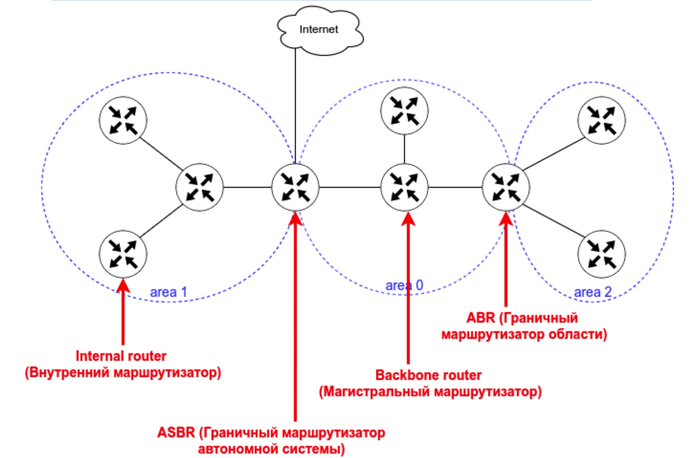
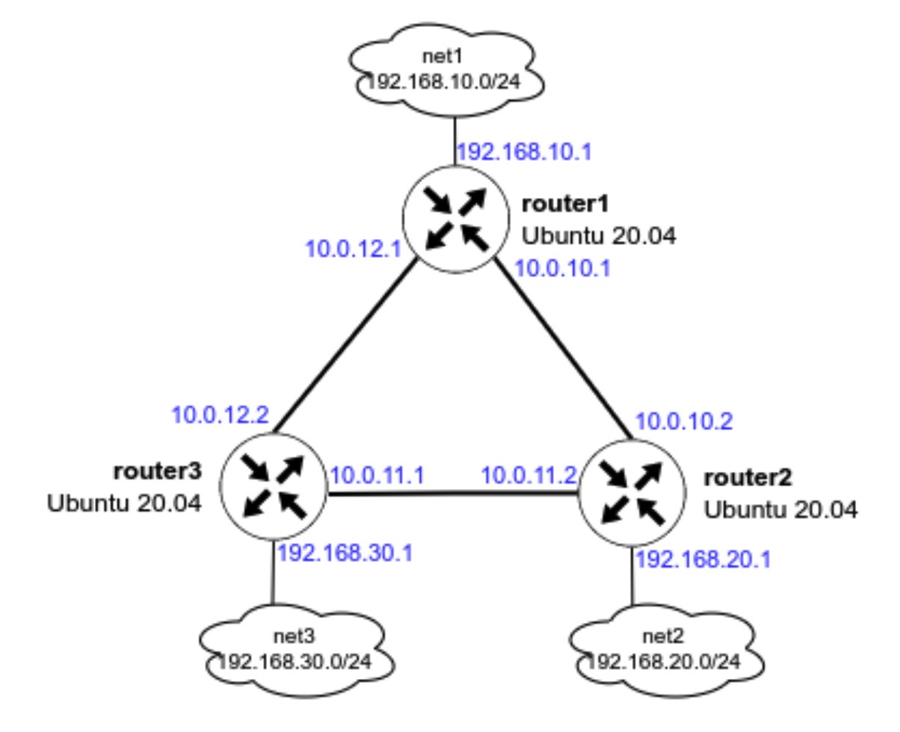

# Статическая и динамическая маршрутизация, OSPF 
  
### Цели занятия
Настроить динамическую маршрутизацию с помощью программных маршрутизаторов FRR  
  
### Описание
1. Развернуть 3 виртуальные машины
2. Объединить их разными vlan
- настроить OSPF между машинами на базе FRR;
- изобразить ассиметричный роутинг;
- сделать один из линков "дорогим", но что бы при этом роутинг был симметричным.
  
### Введение
OSPF — протокол динамической маршрутизации, использующий концепцию разделения на области в целях масштабирования. 
- Административная дистанция OSPF — 110
- Основные свойства протокола OSPF:
  1. Быстрая сходимость
  2. Масштабируемость (подходит для маленьких и больших сетей)
  3. Безопасность (поддежка аутентиикации) 
  4. Эффективность (испольование алгоритма поиска кратчайшего пути)
  
При настроенном OSPF маршрутизатор формирует таблицу топологии с использованием результатов вычислений, основанных на алгоритме кратчайшего пути (SPF) Дейкстры. Алгоритм поиска кратчайшего пути основывается на данных о совокупной стоимости доступа к точке назначения. Стоимость доступа определятся на основе скорости интерфейса. 
Чтобы повысить эффективность и масштабируемость OSPF, протокол поддерживает иерархическую маршрутизацию с помощью областей (area). 
Область OSPF (area) — Часть сети, которой ограничивается формирование базы данных о состоянии каналов. Маршрутизаторы, находящиеся в одной и той же области, имеют одну и ту же базу данных о топологии сети. Для определения областей применяются идентификаторы областей.
Протоколы OSPF бвывают 2-х версий: 
    • OSPFv2
    • OSPFv3
  
Основным отличием протоколов является то, что OSPFv2 работает с IPv4, а OSPFv3 — c IPv6. 
Маршрутизаторы в OSPF классифицируются на основе выполняемой ими функции:  

  
- Internal router (внутренний маршрутизатор) — маршрутизатор, все интерфейсы которого находятся в одной и той же области. 
- Backbone router (магистральный маршрутизатор) — это маршрутизатор, который находится в магистральной зоне (area 0).
- ABR (пограничный маргрутизатор области) — маршрутизатор, интерфейсы которого подключены к разным областям.
- ASBR (Граничный маршрутизатор автономной системы) — это маршрутизатор, у которого интерфейс подключен к внешней сети.  
Также с помощью OSPF можно настроить ассиметричный роутинг.  
Ассиметричная маршрутизация — возможность пересекать сеть в одном направлении, используя один путь, и возвращаться через другой путь.  
  
### Разворачиваем 3 виртуальные машины
  
Так как мы планируем настроить OSPF, все 3 виртуальные машины должны быть соединены между собой (разными VLAN), а также иметь одну (или несколько) доолнительных сетей, к которым, далее OSPF сформирует маршруты. Исходя из данных требований, мы можем нарисовать топологию сети:

  
Для развертывания стенда подготовил Vagrantfile с уже добавленым модулем запуска Ansible-playbook.  
  
После создания данного файла, из терминала идём в каталог, в котором лежит данный Vagrantfile и вводим команду ]]]]```vagrant up```

Результатом выполнения данной команды будут 3 созданные виртуальные машины, которые соединены между собой сетями (10.0.10.0/30, 10.0.11.0/30 и 10.0.12.0/30). У каждого роутера есть дополнительная сеть:  
- на router1 — 192.168.10.0/24
- на router2 — 192.168.20.0/24
- на router3 — 192.168.30.0/24
На данном этапе ping до дополнительных сетей (192.168.10-30.0/24) с соседних роутеров будет недоступен. 
  
Для подключения к ВМ нужно ввести команду ```vagrant ssh <имя машины>```  
  
Перед началом установки и настройки FRR были установлены пакеты:
 - vim;
 - traceroute;
 - tcpdump;
 - net-tools.
  
  ### Настройка OSPF между машинами на базе FRR
  
Для настройки OSPF был подготовлен шаблон конфигурации template/frr.conf.j2, который будет копироваться на хостах по пути /etc/frr/frr.conf и будет содержать в себе информацию о требуемых интерфейсах и OSPF.  
  
Использование шаблона позволяет подставить необходиму информацию для каждого роутера, на основе фактов собираемых ansible. Так настройки ip-адресов интерфейса добавляется конструкцие:  
```ip address {{ ansible_enp0s8['ipv4']['address'] }}/30```  
а данные подсети в настройках OSPF:
```ip address {{ ansible_enp0s8['ipv4']['network'] }}```  
  
  ### Настройка ассиметричного роутинга
  
Для настройки ассиметричного роутинга нам необходимо выключить блокировку ассиметричной маршрутизации:  
```sysctl net.ipv4.conf.all.rp_filter=0```  
  
Настройки ассиметричного роутинга была произведена за счет повышения "стоимости" интерфейсв enp0s8 на router1  
для чего в шаблон была добавлены конструкция:
```
  
 ip ospf cost 1000  
  
 !ip ospf cost 450  
  
```
  
  ###  Настройка симметичного роутинга
  
Настройка симметричного роутинга заключается в том, чтобы добавить правильную настройку в файл /etc/frr/frr.conf
  
Чтобы было легко переключаться между ассиметричным и симметричным роутингом, была добавлена переменная ```symmetric_routing``` со значением по умолчанию ```false``` в файл defaults/main.yml
  
В template frr.conf добавил условие:  
```
  
 ip ospf cost 1000  
  
 ip ospf cost 1000  
  
 !ip ospf cost 450  
  
```
  
Данное условие проверят имя хоста и переменную symmetric_routing и добавляет в темплейт следующие параметры:
- если имя хоста router1 — то добавляется стоимость интерфейса 1000
- если имя хоста router2 И значение параметра symmetric_routing true — то добавляется стоимость интерфейса 1000  
  
В остальных случаях добавляется закомментированный параметр.  
  
Для удобного переключения параметров нам потребуется запускать из ansible-playbook только 2 последних модуля. Чтобы не ждать выполнения всего плейбука, можно добавить тег к модулям:  
```
  - name: set up OSPF   
    template:  
      src: frr.conf.j2  
      dest: /etc/frr/frr.conf  
      owner: frr  
      group: frr  
      mode: 0640  
    tags:  
      - setup_ospf  
  
  - name: restart FRR  
    service:  
      name: frr  
      state: restarted  
      enabled: true  
    tags:  
      - setup_ospf  
```
  
Так можно запускать playbook не полностью. Пример запуска модулей из ansible-playbook, которые помечены тегами:  
```ansible-playbook -i ansible/hosts -l all ansible/provision.yml -t setup_ospf -e "host_key_checking=false"```
  
  ### Рекомендуемые источники
   
- Статья «OSPF» - https://ru.bmstu.wiki/OSPF_(Open_Shortest_Path_First)#.D0.A2.D0.B5.D1.80.D0.BC.D0.B8.D0.BD.D1.8B_.D0.B8_.D0.BE.D1.81.D0.BD.D0.BE.D0.B2.D0.BD.D1.8B.D0.B5_.D0.BF.D0.BE.D0.BD.D1.8F.D1.82.D0.B8.D1.8F_OSPF  
- Статья «IP Routing: OSPF Configuration Guide» - https://www.cisco.com/c/en/us/td/docs/ios-xml/ios/iproute_ospf/configuration/xe-16/iro-xe-16-book/iro-cfg.html
- Документация FRR - http://docs.frrouting.org/en/latest/overview.html
- Статья «Принципы таблицы маршрутизации. Асимметричная маршрутизация» - http://marshrutizatciia.ru/principy-tablicy-marshrutizacii-asimmetrichnaya-marshrutizaciya.html
- Различия межлу протоколами OSPF - https://da2001.ru/CCNA_5.02/2/course/module8/8.3.1.3/8.3.1.3.html#:~:text=%D0%9A%D0%BE%D0%BD%D1%84%D0%B8%D0%B3%D1%83%D1%80%D0%B0%D1%86%D0%B8%D1%8F%20OSPFv3%20%D0%B4%D0%BB%D1%8F%20%D0%BE%D0%B4%D0%BD%D0%BE%D0%B9%20%D0%BE%D0%B1%D0%BB%D0%B0%D1%81%D1%82%D0%B8&text=%D0%98%D1%81%D1%85%D0%BE%D0%B4%D0%BD%D1%8B%D0%B9%20%D0%B0%D0%B4%D1%80%D0%B5%D1%81%20%E2%80%94%20%D1%81%D0%BE%D0%BE%D0%B1%D1%89%D0%B5%D0%BD%D0%B8%D1%8F%20OSPFv2%20%D0%BF%D0%BE%D1%81%D1%82%D1%83%D0%BF%D0%B0%D1%8E%D1%82,%D1%82%D0%B8%D0%BF%D0%B0%20link%2Dlocal%20%D0%B2%D1%8B%D1%85%D0%BE%D0%B4%D0%BD%D0%BE%D0%B3%D0%BE%20%D0%B8%D0%BD%D1%82%D0%B5%D1%80%D1%84%D0%B5%D0%B9%D1%81%D0%B0.
- Документация по Templating(jinja2) - https://docs.ansible.com/ansible/2.9/user_guide/playbooks_templating.html